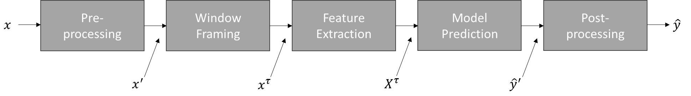

# PyDTS
Python Deep Timeseries Simulation (PyDTS) is a toolkit for capturing unknown and possibly non-linear relations between
input and output values. The current version includes statistical, machine learning, and deep-learning approaches for 
time-series modeling. The aim is to provide a better understanding of time-series modeling problems such as: forecasting,
denoising, non-linear SISO and MIMO modeling, degradation modeling, and anomaly detection. It is clear, that this toolkit
cannot be anywhere near the capabilities  of commercial software but will hopefully provide a better understanding due
to the freely available source code. The toolkit is not complete; thus, suggestions are always welcome.

# Publication and Citation
Please cite the following paper when using PyDTS for your work

Schirmer, P.A.; Mporas, I. PyDTS: A Python Toolkit for Deep Learning Time Series Modelling. Entropy 2024, 26, 311. https://doi.org/10.3390/e26040311

(https://www.mdpi.com/1099-4300/26/4/311)

Furthermore, please also cite the corresponding publicly available datasets.

# Dependencies
The requirements of the PyPowerSim toolkit are summarized in the requirements.txt data file. In detail, the PyDTS
Toolkit was implemented using the following dependencies:
- Python 3.8
- Tensorflow 2.5
- Scikit-Lean 1.0 
- Numpy 
- Pandas
- Scipy

Additionally, Python 3.11 with tensorflow 2.13 was tested. The requirements.txt file was updated for version 3.11, while
the old requirements have been store using req38.txt. Furthermore, when changing back to Python 3.8 the optimizer must
be changed from "tf.keras.optimizers.legacy.Adam" to "tf.keras.optimizers.Adam" (similarly for all other optimizers).

# Datasets
The toolkit utilizes the following publicly available datasets, which have been pre-processed and reshaped for the users'
convenience and can be found under /data. The datasets have been clustered into one test dataset to show the working
principle of the toolkit and six tutorials covering different applications for time-series modeling. It should be noted
that all datasets are measured and no synthetic data has been used.

1) Tutorial 1 (Denoising) based on AMPDs2 dataset [1] (CC-BY 4.0): https://dataverse.harvard.edu/dataset.xhtml?persistentId=doi:10.7910/DVN/FIE0S4
2) Tutorial 2 (Forecasting) based on dataset [2]: https://www.kaggle.com/datasets/fedesoriano/electric-power-consumption
3) Tutorial 3 (Non-linear modeling) based on Electric Motor Temperature [3] (CC BY-SA 4.0): https://www.kaggle.com/datasets/wkirgsn/electric-motor-temperature
4) Tutorial 4 (Anomaly detection) based on Ford dataset [4]: https://www.timeseriesclassification.com/description.php?Dataset=FordA
5) Tutorial 5 (Degradation modeling) based on Battery aging [5] (CC BY 4.0): https://kilthub.cmu.edu/articles/dataset/eVTOL_Battery_Dataset/14226830/2
6) Tutorial 6 (Cross Domain modeling) based on vehicle data [6] (CC-BY 4.0): https://ieee-dataport.org/open-access/battery-and-heating-data-real-driving-cycles
7) Tutorial 7 (Short Term forecasting) based on energy generation data (example data)
8) Tutorial 8 (Closed Loop modeling) based on Electric Motor Temperature [3] (CC BY-SA 4.0): https://www.kaggle.com/datasets/wkirgsn/electric-motor-temperature

If the user wants to utilize their own datasets, data can be provided in '.csv', '.xlsx', and '.mat' formats at the moment.
Data templates can be found under \data.

# Limitations
Since the toolkit is still under development there are several things that need to be improved, are not yet implemented 
or lack verification. In the following a list of known issues and limitations is provided:
- The transfer functions are not yet reviewed and have shown inconsistent behavior
- The data balancing function is currently not working and must be revised
- There are minor issues for displaying and formatting units

# Architecture
The aim of the PyDTS toolkit is to model the input and output relation of an unknown system, namely $\hat{y}=f(X)$ where 
$X \in \mathbb{R}^{T \times M}$ is a feature input vector of $T$ time-steps and $M$ features and $y$ is a time-series output. A more
generalized architecture is illustrated below:

As can be seen, the general architecture consists of five steps namely pre-processing (e.g. resampling or filtering), window
framing, feature extraction, model prediction, and post-processing (e.g. limiting the output). The architecture is used
for all applications which are described below. Additionally, the different modules  offered by PyDTS and the flow diagram for the
different operations are illustrated below:

Overview of implemented modules and functionalities in the PyDTS toolkit. Inputs and
preprocessing are indicated in red, features and data sequencing in yellow, modelling in green,
postprocessing in blue, and visual elements and outputs in purple.

Internal data pipeline of PyDTS including training and testing modules and external data,
model, and setup databases.

## Applications
The toolkit aims to cover different applications as they usually appear in industrial settings for time-series modeling.
The following applications have been covered:

1) Denoising (Regression): $y(t)=\sum_{m} x_m(t) + \epsilon(t)$
2) Forecasting (Regression): $y(t) = \phi y(t − 1) + \beta x(t) + \epsilon(t)$
3) Non-linear modeling (Regression): $y(t)=f(x(t))$
4) Anomaly detection (Classification): $y(t)= \theta(f(x(t)))$
5) Degradation modeling (Regression): $y(t) = y_{0} + \beta x(t) + \epsilon(t)$

## Operating Modes
The toolkit offers three different operating modes. The operating modes can be controlled using 'setupExp['sim']' option
in the start.py file. The following three options are available. First, classical training and testing where a model is
trained using a training and validation dataset, and tested on a testing dataset respectively. Second, hyperparameters
optimization where free model parameters are optimally tuned using scikit GridSearchCV for machine learning models and
keras hyper band tuner for deep learning models utilizing tensorboard. Third, general parameters can be optimized using
a 2D grid search available in 'optiGrid.py'.

## Models
The toolkit as three different types of models implemented namely models based on Signal Processing (SP), e.g. State-Space (SS)
models or Transfer Function (TF) models, models based on Machine Learning (ML), e.g. Support Vector Machine (SVM) or Random
Forest (RF), models based on Deep Learning (DL), e.g. Long Short Term Memory (LSTM) or Convolutional Neural Network (CNN). Furthermore,
options for short-term time-series forecasting (SF) and closed loop (CL) modeling approaches are available. The input and
output relations (I/O) of the different models are illustrated in the figure below:

| SP/ML/DL                         | Short-Term Forecasting (SF)      | Closed Loop (CL)                 |
|----------------------------------|----------------------------------|----------------------------------|
|  | | |

where $X$ is an input time-series with $T$ samples and $F$ features, and $y$ is the output time-series with $T$ samples
and $L$ channels. Further, considering forecasting $W$ is the number of previous samples, while $H$ denotes the prediction
horizon. $X_{H}$ denotes historic time-series inputs, while $X_{F}$ denotes future value inputs.

# Exemplary Results
In the following chapter, a set of reference results is provided using the “default.txt” setup files provided in \setup. 
For a first test run use start.py to calculate the results presented below, which are already provided as pre-trained
models under \mdl. Therefore, training is disabled in start.py. The problem considered in the test example aims to model
the regenerative power ($MW$) of solar and wind generated in Germany. As input features standard weather data are available,
namely solar irradiance ($\frac{W}{m^2}$), wind speed ($\frac{m}{s}$), and temperature ($°C$).

## Average Results
The average results for different models in terms of Mean Absolute Error (MAE) are provided in the table below. All
results have been obtained using the default parameters of the toolkit. 

| Output     | SVM (ML) | KNN (ML) | RF (ML) | DNN (DL) | LSTM (DL)   | CNN (DL) |
|------------|----------|----------|---------|----------|-------------|----------|
| Solar (MW) | 2717.31  | 3092.78  | 725.93  | 996.56   | **685.31**  | 800.04   | 
| Wind  (MW) | 2937.16  | 3603.52  | 2360.53 | 2096.60  | **1988.47** | 2006.85  | 
| Avg (MW)   | 2827.24  | 3348.15  | 1543.23 | 1546.58  | **1336.89** | 1403.45  |

As can be seen from the table above, DL approaches consistently equalize or outperform ML approaches for all
architectures. Furthermore, it should be noted that the LSTM DL model shows the best results due to its ability to
capture temporal information.

## Detailed Results
The simulation output contains three different plots. The first one provides an analysis of the input features using
violin plots, a heatmap of the input and output features, as well as a feature ranking calculated by RF. The second one
plots the ground truth against the predicted values and evaluates mean error and error distribution. The third one shows
the predicted results as well as the error with respect to the ground truth for both raw values and labels.

Figure 1: Input feature analysis, heatmap, and feature ranking using RF classifier.

Figure 2: Scattering results, Gaussian error distribution, and average accuracy values.

Figure 3: Ground-truth and predicted values for solar irradiance.

Figure 4: Ground-truth and predicted values for wind speed.

# State-of-the-Art Comparison
To enable comparison with previously published methods two comparisons have been made using the PyDTS 
toolkit, namely one for the task of energy disaggregation(a highly undetermined problem) and for the task 
of temperature prediction (a highly non-linear problem). The aim is not to outperform the best-performing 
approaches from the literature, as usually these are very specifically optimized for the respective problem, 
but to illustrate how good a baseline methodology provided by the PyDTS toolkit will work for the 
respective tasks.

## Energy Disaggregation
For energy disaggregation we consider again the AMPDs2 dataset from Tutorial 1 and compare the results for a scenario of
10-fold cross validation using the five most used appliances in the dataset, namely ‘DWE’, 'FRE', 'HPE', ‘WOE’, and
'CDE'. CNN has been used as it was found to work best for the disaggregation task. The detailed setup files are the
same as in the BaseNILM toolkit (https://github.com/pascme05/BaseNILM) and the numerical results are tabulated
in Table 10.

| Device | TECA   | RMSE (A) | MSE (A^2) | MAE (A) | MAX (A) |
|--------|--------|----------|-----------|---------|---------|
| DWE    | 49.61% | 0.87     | 0.93      | 0.13    | 6.60    | 
| FRE    | 97.52% | 0.11     | 0.33      | 0.06    | 2.96    | 
| HPE    | 98.02% | 0.59     | 0.77      | 0.07    | 47.90   | 
| WOE    | 93.83% | 0.44     | 0.66      | 0.02    | 29.89   | 
| CDE    | 97.60% | 0.36     | 0.60      | 0.02    | 39.96   | 
| Avg    | 87.31% | 0.47     | 0.69      | 0.06    | 25.46   |

For the comparison with the literature three different devices have been considered namely 'HPE', ‘WOE’, and 'CDE', 
the results are provided in the Table below.

| REF   | Year | Model | TECA   | RMSE (W) | MAE(W) |
|-------|------|-------|--------|----------|--------|
| [7]   | 2021 | GAN   | -      | 35.3     | -      |
| [8]   | 2020 | GAN   | -      | 38.5     | -      |
| [9]   | 2019 | LSTM  | -      | 38.6     | -      |
| [10]  | 2018 | CNN   | -      | 63.4     | -      |
| PyDTS | 2023 | CNN   | 91.22% | 44.7     | 2.32   |

## Temperature Prediction
For temperature prediction, we consider again the Motor Temperature dataset from tutorial 3 and compare the results 
using the same train, test, and validation split as proposed in [13]. As a regression model, we have used the
same CNN from Tutorial 3, as it has shown the best performance among all other models. The detailed setup
files can be found under \setup and the numerical results are tabulated below.

| Test ID | Time (hrs) | Stator Winding | Stator Tooth | Stator Yoke | Permanent Magnet |
|---------|------------|----------------|--------------|-------------|------------------|
| 60      | 1.7        | 4.80           | 3.20         | 1.66        | 30.8             |
| 62      | 3.3        | 1.06           | 0.62         | 0.40        | 2.13             |
| 74      | 3.0        | 3.42           | 2.37         | 1.36        | 13.6             |
| Avg     | 8.0        | 2.74           | 1.82         | 1.03        | 12.5             |

As can be seen in the Table above the difficulty of estimating the temperatures in the different test IDs varies significantly, 
with the lowest errors being found in test ID 62 and the highest in test ID60. On average the results are better for
the stator temperatures, which is in line with the input features being mostly stator quantities. To compare the results
with the previously published literature a comparison of average errors was made.

| REF   | Year | Model | MSE (K^2) | MAX (W)  | Features |
|-------|------|-------|-----------|----------|----------|
| [11]  | 2021 | MLP   | 5.58      | 14.29    | 81       |
| [11]  | 2021 | OLS   | 4.47      | 9.85     | 81       |
| [12]  | 2020 | CNN   | 4.43      | 15.54    | 81       |
| [13]  | 2023 | TNN   | **2.87**  | **6.02** | 15       |
| PyDTS | 2023 | CNN   | 4.53      | 10.91    | 13       |

As can be seen in the Table above the results obtained from the baseline CNN model implemented in PyDTS are comparable to 
the results obtained with other machine- or deep-learning architectures. Only physically informed approaches like thermal
neural networks [13] perform significantly better.

# Development
As failure and mistakes are inextricably linked to human nature, the toolkit is obviously not perfect, 
thus suggestions and constructive feedback are always welcome. If you want to contribute to the PyDTS
toolkit or spot any mistake, please contact me via: p.schirmer@herts.ac.uk

# License
The software framework is provided under the Attribution-NonCommercial-NoDerivatives 4.0 International (CC BY-NC-ND 4.0) license.

# Version History
1) v.0.1: (26.10.2023) Initial version of PyDTS
2) v.0.2: (24.04.2024) Adding forecasting methodology
3) v.0.3: (21.05.2024) Updating Python 3.11 and adding new DL models
   

# References
[1] Makonin, S., Ellert, B., Bajić, I. et al. Electricity, water, and natural gas consumption of a residential house in Canada from 2012 to 2014. Sci Data 3, 160037 (2016). https://doi.org/10.1038/sdata.2016.37

[2] Dedesoriano. (August 2022). Electric Power Consumption. Retrieved from https://www.kaggle.com/datasets/fedesoriano/electric-power-consumption

[3] W. Kirchgässner, O. Wallscheid and J. Böcker, "Estimating Electric Motor Temperatures With Deep Residual Machine Learning," in IEEE Transactions on Power Electronics, vol. 36, no. 7, pp. 7480-7488, July 2021, doi: 10.1109/TPEL.2020.3045596

[4] Wichard, Joerg D. "Classification of Ford Motor Data." Computer Science (2008).

[5] Bills, A., Sripad, S., Fredericks, L. et al. A battery dataset for electric vertical takeoff and landing aircraft. Sci Data 10, 344 (2023). https://doi.org/10.1038/s41597-023-02180-5

[6] Matthias Steinstraeter, Johannes Buberger, Dimitar Trifonov, October 19, 2020, "Battery and Heating Data in Real Driving Cycles", IEEE Dataport, doi: https://dx.doi.org/10.21227/6jr9-5235

[7] M. Kaselimi, N. Doulamis, A. Voulodimos, A. Doulamis and E. Protopapadakis, "EnerGAN++: A Generative Adversarial Gated Recurrent Network for Robust Energy Disaggregation," in IEEE Open Journal of Signal Processing, vol. 2, pp. 1-16, 2021, doi: 10.1109/OJSP.2020.3045829

[8] M. Kaselimi, A. Voulodimos, E. Protopapadakis, N. Doulamis and A. Doulamis, "EnerGAN: A GENERATIVE ADVERSARIAL NETWORK FOR ENERGY DISAGGREGATION," ICASSP 2020 - 2020 IEEE International Conference on Acoustics, Speech and Signal Processing (ICASSP), Barcelona, Spain, 2020, pp. 1578-1582, doi: 10.1109/ICASSP40776.2020.9054342

[9] M. Kaselimi, N. Doulamis, A. Doulamis, A. Voulodimos and E. Protopapadakis, "Bayesian-optimized Bidirectional LSTM Regression Model for Non-intrusive Load Monitoring," ICASSP 2019 - 2019 IEEE International Conference on Acoustics, Speech and Signal Processing (ICASSP), Brighton, UK, 2019, pp. 2747-2751, doi: 10.1109/ICASSP.2019.8683110

[10] Chen, Kunjin, et al. "Convolutional sequence to sequence non‐intrusive load monitoring." the Journal of Engineering 2018.17 (2018): 1860-1864.

[11] Kirchgässner, Wilhelm, Oliver Wallscheid, and Joachim Böcker. "Data-driven permanent magnet temperature estimation in synchronous motors with supervised machine learning: A benchmark." IEEE Transactions on Energy Conversion 36.3 (2021): 2059-2067.

[12] W. Kirchgässner, O. Wallscheid and J. Böcker, "Estimating Electric Motor Temperatures With Deep Residual Machine Learning," in IEEE Transactions on Power Electronics, vol. 36, no. 7, pp. 7480-7488, July 2021, doi: 10.1109/TPEL.2020.3045596

[13] Kirchgässner, Wilhelm, Oliver Wallscheid, and Joachim Böcker. "Thermal neural networks: Lumped-parameter thermal modeling with state-space machine learning." Engineering Applications of Artificial Intelligence 117 (2023): 105537.
